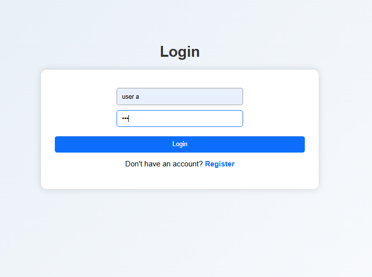
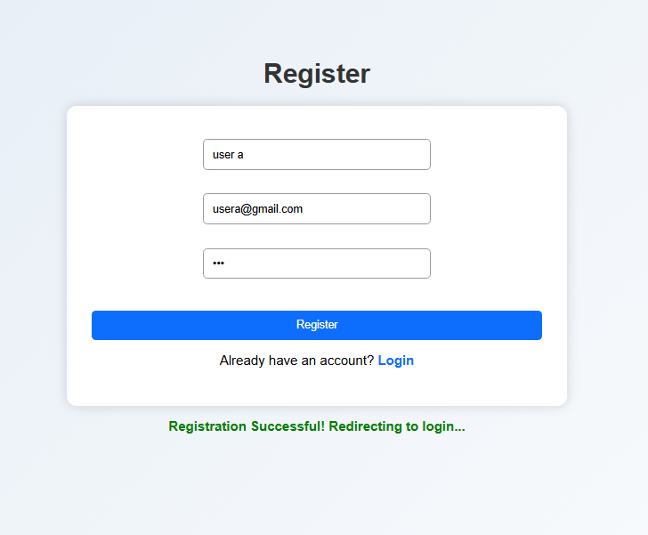
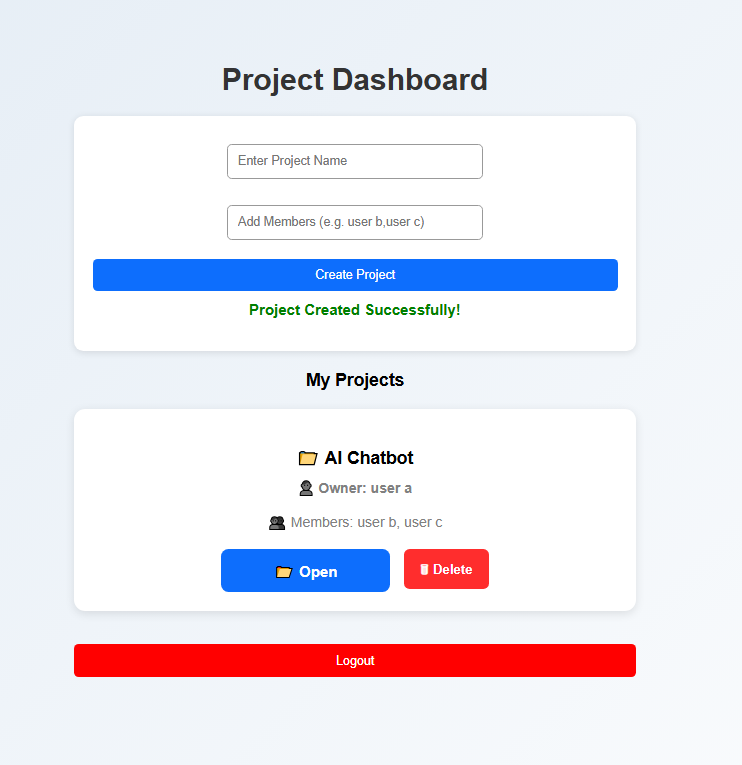

# 📋 Project Management Tool

A full-stack Project Management Tool built using **Node.js, Express.js, MongoDB, HTML, CSS, and JavaScript**. This application allows users to register, log in securely, create collaborative projects, assign tasks, communicate through comments, and manage projects efficiently.

---

# 🚀 Features

## 🔐 Authentication
- User Registration
- User Login
- Secure password hashing using **bcrypt**
- Duplicate username validation

## 👥 Collaborative Project Management
- Create new projects
- Add multiple project members
- View project owner
- View project members
- Shared projects visible to assigned members
- Delete projects

## ✅ Task Management
- Create tasks
- Assign tasks to team members
- View project tasks
- Delete tasks

## 💬 Task Collaboration
- Add comments to tasks
- View task discussions
- Store comments in MongoDB

## 📊 Dashboard
- View all owned and shared projects
- Open project workspace
- Logout functionality
- Success messages after actions

---

# 🛠️ Tech Stack

### Frontend
- HTML5
- CSS3
- JavaScript

### Backend
- Node.js
- Express.js

### Database
- MongoDB Atlas
- Mongoose

### Authentication
- bcrypt

---

# 📂 Project Structure

```text
Project-Management-Tool/
│
├── backend/
│   ├── models/
│   │   ├── User.js
│   │   ├── Project.js
│   │   └── Task.js
│   │
│   ├── server.js
│   ├── package.json
│   └── .env
│
├── frontend/
│   ├── css/
│   │   └── style.css
│   │
│   ├── js/
│   │   ├── register.js
│   │   ├── login.js
│   │   ├── dashboard.js
│   │   └── project.js
│   │
│   ├── register.html
│   ├── login.html
│   ├── dashboard.html
│   └── project.html
│
├── screenshots/
│
├── README.md
└── .gitignore
```

---

# ⚙️ Installation

### 1. Clone the repository

```bash
git clone https://github.com/muskan1766/Project-Management-Tool.git
```

### 2. Navigate to the project folder

```bash
cd Project-Management-Tool
```

### 3. Install backend dependencies

```bash
cd backend
npm install
```

### 4. Create a `.env` file

```env
MONGO_URI=your_mongodb_connection_string
```

### 5. Start the backend server

```bash
node server.js
```

The backend will run on:

```
http://localhost:5000
```

### 6. Run the frontend

Open the **frontend** folder using **Live Server** in VS Code.

---

# 📸 Screenshots

## Login Page



---

## Register Page



---

## Dashboard



---

## Project Tasks


---

# 🌟 Highlights

- 🔐 Secure user authentication with password hashing
- 👥 Collaborative group projects with multiple members
- 📋 Task assignment and management
- 💬 Comment system for team collaboration
- 📁 Project owner and member management
- 🎨 Clean and responsive user interface
- 💾 MongoDB Atlas integration

---

# 👩‍💻 Author

**Muskan Malik**

GitHub: https://github.com/muskan1766